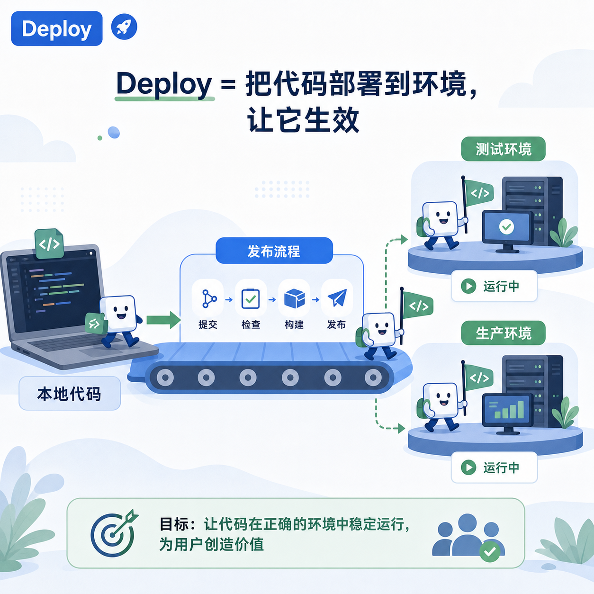
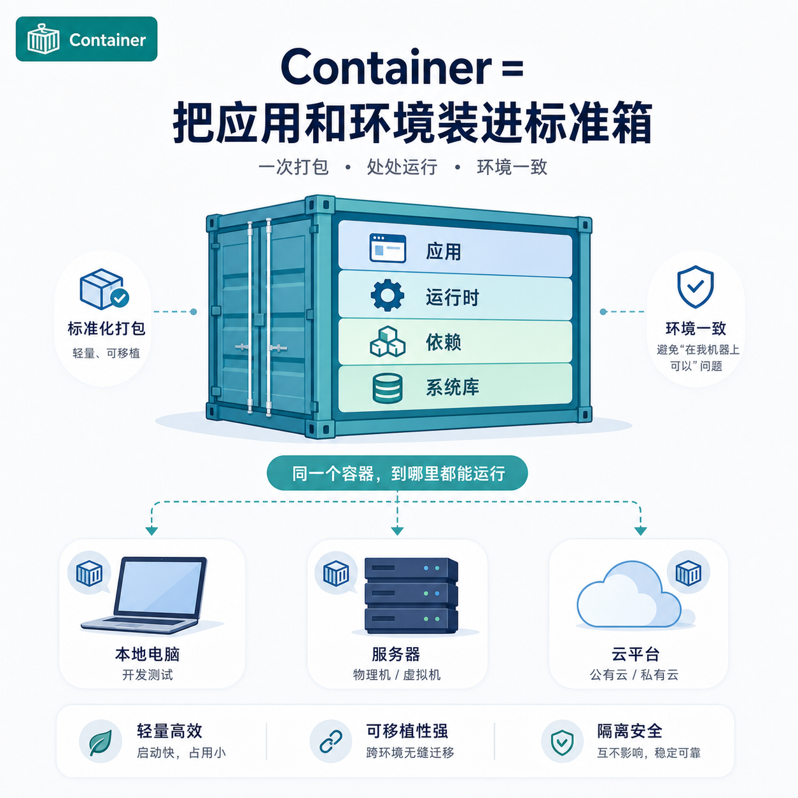
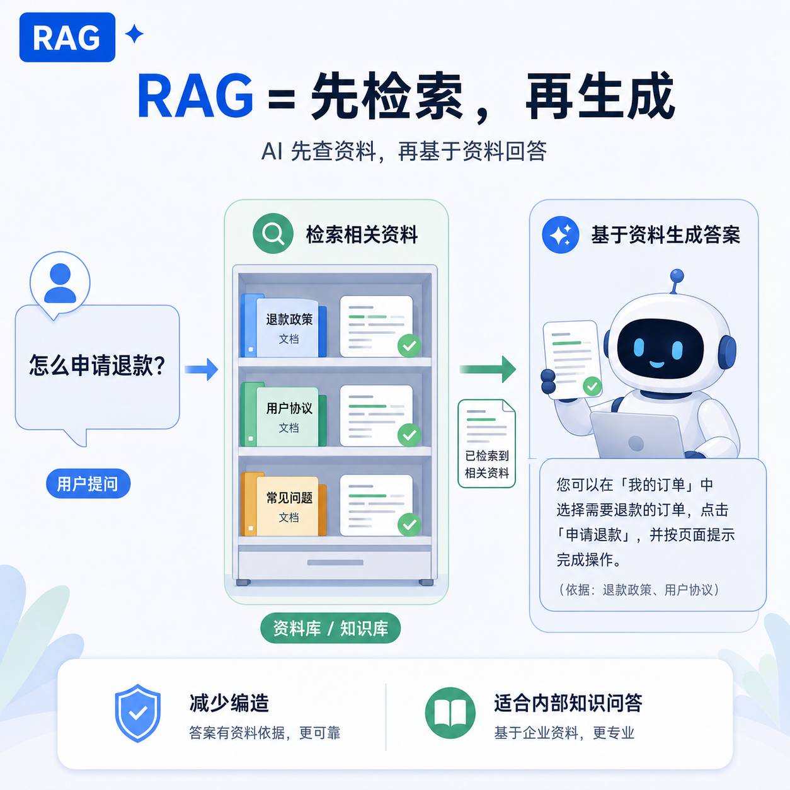
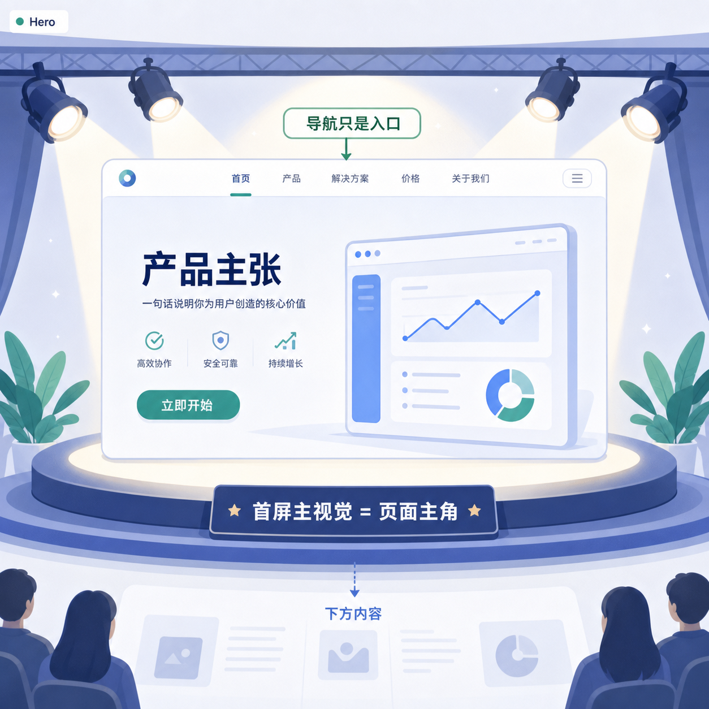
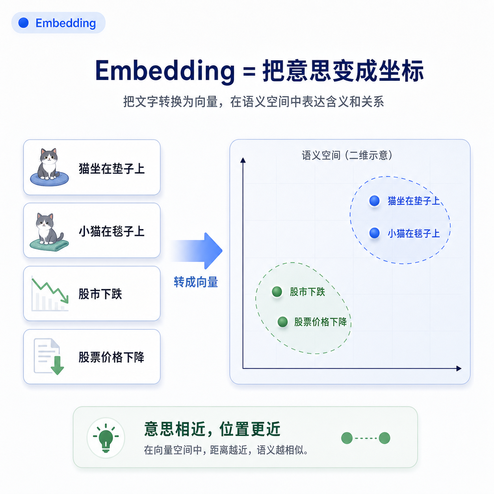
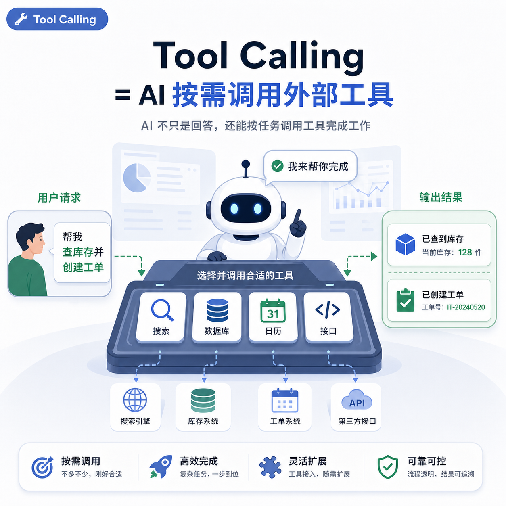

# 技术产品 AI 英文术语知识卡

> 目标：帮助理解互联网产品、开发协作、基础设施和 AI 语境中的英文术语。  
> 使用方式：每张卡先看词汇和谐音，再用「一句话理解」建立概念，最后通过「不要误解」和「真实沟通例句」掌握工作语境。

## 字段说明

- 分类：这个词主要出现在哪类工作场景。
- 标准发音：近似音标或常见读法。
- 中文谐音：帮助记住大概读音，不作为准确发音标准。
- 拆词/来源：缩写展开、词根、字面含义或来源。
- 一句话理解：用最短的话解释核心语义。
- 中文工作表达：在中文协作中自然怎么说。
- 画面联想：用画面建立记忆钩子。
- 故事记忆：用工作场景加深理解。
- 不要误解为：容易混淆的边界。
- 常见表达：高频搭配。
- 真实沟通例句：英文表达和中文含义。
- 图片生成提示词：需要生成记忆图片时可直接使用。

## 1. UX

```text
【分类】
产品与设计

【词汇】
UX = User Experience

【标准发音】
/juː eks/

【中文谐音】
优-艾克斯

【拆词/来源】
User = 用户；Experience = 体验。

【一句话理解】
用户在使用产品全过程中的感受、效率、理解成本和满意度。

【中文工作表达】
用户体验 / UX 体验 / 使用体验

【画面联想】
用户走进一个产品迷宫，UX 好就是路标清楚、路径顺畅；UX 差就是到处撞墙。

【故事记忆】
一个用户想上传图片，但按钮藏得很深，流程又要反复确认。页面可能很好看，但用户完成任务很痛苦，这就是 UX 不好。

【不要误解为】
UX 不等于 UI。UI 是界面长什么样，UX 是用户用起来是否顺。

【常见表达】
UX design / improve UX / poor UX / user experience

【真实沟通例句】
The UX is confusing because users cannot find the upload button.
用户体验很混乱，因为用户找不到上传按钮。

【图片生成提示词】
A clean product design metaphor showing a user walking through two app paths: one clear and smooth with signs, one confusing with dead ends. Professional UI education style, minimal, no cartoon clutter.
```

## 2. Product

```text
【分类】
产品与业务

【词汇】
Product

【标准发音】
/ˈprɑːdʌkt/

【中文谐音】
普拉达克特

【拆词/来源】
product 表示被生产出来并交付使用的东西；互联网语境里常指产品、功能或服务整体。

【一句话理解】
被设计、开发并交付给用户使用的产品或功能整体。

【中文工作表达】
产品 / 产品功能 / 产品方案

【画面联想】
一个产品像一台完整机器，不只是按钮和页面，还包括用户、流程、数据和商业目标。

【故事记忆】
开发问「Is this a product requirement?」不是问页面好不好看，而是在确认这是否是明确的产品需求。

【不要误解为】
Product 不只是商品，在互联网语境里可以是 App、系统、功能模块或服务。

【常见表达】
product requirement / product roadmap / product manager / product goal

【真实沟通例句】
We need to clarify the product goal before designing the feature.
设计这个功能前，我们需要先明确产品目标。

【图片生成提示词】
A professional diagram of a digital product as a machine combining user needs, interface screens, data, workflow, and business goals. Clean modern style.
```

## 3. MVP

```text
【分类】
产品验证

【词汇】
MVP = Minimum Viable Product

【标准发音】
/em viː piː/

【中文谐音】
艾姆-维-皮

【拆词/来源】
Minimum = 最小；Viable = 可行；Product = 产品。

【一句话理解】
能验证核心假设的最小可用产品版本。

【中文工作表达】
最小可行产品 / MVP 版本

【画面联想】
先造一辆能跑的滑板车验证方向，而不是一开始就造豪华汽车。

【故事记忆】
团队想做 20 个功能，但真正要验证的是用户愿不愿意下单。那 MVP 可能只需要一个下单页。

【不要误解为】
MVP 不是粗糙半成品，而是足够小、但能验证关键问题的版本。

【常见表达】
build an MVP / MVP scope / MVP launch / MVP version

【真实沟通例句】
Let's reduce the scope and launch an MVP first.
我们先缩小范围，发布一个 MVP 版本。

【图片生成提示词】
A product development metaphor comparing a simple working skateboard prototype with a complex car blueprint, showing minimum viable product thinking. Clean professional style.
```

## 4. A/B Test

```text
【分类】
增长与实验

【词汇】
A/B Test

【标准发音】
/eɪ biː test/

【中文谐音】
诶-比-泰斯特

【拆词/来源】
A 版本和 B 版本的对照实验。

【一句话理解】
同时测试两个版本，看哪个版本在数据上表现更好。

【中文工作表达】
A/B 测试 / 对照实验

【画面联想】
两扇门 A 和 B 同时打开，看用户更愿意走哪一扇。

【故事记忆】
按钮文案到底用「立即开始」还是「免费试用」？不要靠争论决定，做 A/B Test 看转化率。

【不要误解为】
A/B Test 不是凭感觉比较，而是需要流量、指标和统计判断。

【常见表达】
run an A/B test / test variant / control group / experiment result

【真实沟通例句】
We should run an A/B test before changing the signup flow.
修改注册流程前，我们应该先做一次 A/B 测试。

【图片生成提示词】
A clean analytics illustration with two app screens labeled A and B, users split into two paths, and a dashboard comparing conversion rate. Professional SaaS style.
```

## 5. Conversion

```text
【分类】
增长与数据

【词汇】
Conversion

【标准发音】
/kənˈvɜːrʒən/

【中文谐音】
肯-沃-任

【拆词/来源】
convert = 转变；conversion = 转化。

【一句话理解】
用户完成了你希望他完成的关键动作。

【中文工作表达】
转化 / 转化率 / 转化行为

【画面联想】
用户从路人变成注册用户，再变成付费用户，像一级一级过关。

【故事记忆】
用户看了页面不算 conversion，点击购买、提交表单、完成注册才可能算。

【不要误解为】
Conversion 不一定是付费，也可以是注册、点击、预约、下载。

【常见表达】
conversion rate / improve conversion / conversion goal / conversion event

【真实沟通例句】
The new hero section increased the conversion rate by 12%.
新的首屏主视觉让转化率提升了 12%。

【图片生成提示词】
A clean funnel-style visual showing anonymous visitors transforming into signed-up users and paying customers, with conversion checkpoints. Modern analytics design.
```

## 6. Funnel


```text
【分类】
增长与用户路径

【词汇】
Funnel

【标准发音】
/ˈfʌnəl/

【中文谐音】
发呢欧 / 发诺

【拆词/来源】
原意是漏斗。

【一句话理解】
用户从进入产品到完成目标动作的逐层流失路径。

【中文工作表达】
漏斗 / 转化漏斗 / 用户漏斗

【画面联想】
很多用户从漏斗上方进来，经过浏览、注册、下单，每一层都会掉一部分。

【故事记忆】
首页访问 10000 人，注册 1000 人，付费 100 人，这就是一个典型 funnel。

【不要误解为】
Funnel 不是一个页面，而是一串用户行为路径。

【常见表达】
sales funnel / conversion funnel / funnel analysis / drop-off

【真实沟通例句】
We need to find where users drop off in the funnel.
我们需要找到用户在漏斗的哪一步流失。

【图片生成提示词】
A professional conversion funnel diagram showing visitors, signups, trials, and paid users narrowing step by step, with drop-off points highlighted.
```

## 7. API


```text
【分类】
后端与接口

【词汇】
API = Application Programming Interface

【标准发音】
/eɪ piː aɪ/

【中文谐音】
诶-屁-爱

【拆词/来源】
Application = 应用；Programming = 编程；Interface = 接口。

【一句话理解】
不同系统之间互相请求数据或能力的接口规则。

【中文工作表达】
接口 / API 接口

【画面联想】
API 像餐厅服务员，你点菜，它把请求传给厨房，再把结果端回来。

【故事记忆】
前端页面要展示用户头像，但头像在后端数据库里，前端就通过 API 去拿。

【不要误解为】
API 不是数据库本身，而是访问系统能力的一套入口和规则。

【常见表达】
call an API / API response / API documentation / API endpoint

【真实沟通例句】
The frontend needs an API to fetch the user profile.
前端需要一个 API 来获取用户资料。

【图片生成提示词】
A clean metaphor of an API as a waiter between a frontend app screen and a backend kitchen/server, carrying requests and responses. Professional technical diagram.
```

## 8. Deploy



```text
【分类】
工程发布

【词汇】
Deploy

【标准发音】
/dɪˈplɔɪ/

【中文谐音】
迪-普洛伊

【拆词/来源】
原有部署、展开的含义。

【一句话理解】
把代码、服务或配置发布到某个环境，让它真正运行或生效。

【中文工作表达】
部署 / 发布到环境

【画面联想】
代码像一支队伍，从本地出发，被部署到测试环境或生产环境的阵地上。

【故事记忆】
代码写完不等于用户能用，只有 deploy 到 production 后，线上用户才看得到。

【不要误解为】
Deploy 不只是上传代码，重点是让服务在目标环境中可运行。

【常见表达】
deploy to staging / deploy to production / deployment failed

【真实沟通例句】
Can we deploy this change to staging first?
我们可以先把这个改动部署到测试环境吗？

【图片生成提示词】
A clean DevOps visual showing code moving from a developer laptop through a deployment pipeline into staging and production environments. Professional engineering style.
```

## 9. Container



```text
【分类】
基础设施

【词汇】
Container

【标准发音】
/kənˈteɪnər/

【中文谐音】
肯-忒-呢儿

【拆词/来源】
contain = 包含；container = 容器。

【一句话理解】
把应用和它需要的运行环境打包在一起的轻量运行单元。

【中文工作表达】
容器 / 容器化

【画面联想】
应用像货物，container 像标准集装箱，装好后可以在不同船、车、港口运输。

【故事记忆】
开发电脑能跑，服务器不能跑，往往是环境不同。Container 就是把环境一起打包。

【不要误解为】
Container 不是虚拟机，但它能隔离运行环境。

【常见表达】
Docker container / container image / containerized app

【真实沟通例句】
The service runs inside a Docker container.
这个服务运行在 Docker 容器里。

【图片生成提示词】
A clean infrastructure illustration showing an app packaged in a shipping container with its runtime and dependencies, moving across laptop, server, and cloud environments.
```

## 10. Serverless

```text
【分类】
云与基础设施

【词汇】
Serverless

【标准发音】
/ˈsɜːrvərləs/

【中文谐音】
瑟沃儿-勒斯

【拆词/来源】
server = 服务器；less = 少/无。

【一句话理解】
开发者不用直接管理服务器，由云平台按需运行代码。

【中文工作表达】
无服务器架构 / Serverless

【画面联想】
你只把包裹交给快递柜，背后的仓库、车辆、调度都由平台处理。

【故事记忆】
你写一个图片压缩函数，用户上传图片时自动运行，没人用时不占服务器。

【不要误解为】
Serverless 不是没有服务器，而是你不用直接管理服务器。

【常见表达】
serverless function / AWS Lambda / cloud function / event trigger

【真实沟通例句】
We can use a serverless function for image processing.
我们可以用一个 serverless 函数来处理图片。

【图片生成提示词】
A clean cloud architecture metaphor showing a developer sending code to a cloud platform, where functions run automatically on demand without visible server management.
```

## 11. Repository

```text
【分类】
开发协作

【词汇】
Repository / Repo

【标准发音】
/rɪˈpɑːzətɔːri/

【中文谐音】
瑞-帕-泽-托瑞

【拆词/来源】
repository = 存储库。

【一句话理解】
存放代码、历史记录和协作信息的代码仓库。

【中文工作表达】
代码仓库 / 仓库 / repo

【画面联想】
Repo 像项目资料室，代码、版本历史、分支、PR 都放在里面。

【故事记忆】
开发说「push it to the repo」，意思是把代码提交到团队共享的代码仓库。

【不要误解为】
Repository 不是普通文件夹，它通常指受 Git 管理的项目仓库。

【常见表达】
Git repository / clone a repo / private repo / repository link

【真实沟通例句】
Please share the repository link with the team.
请把代码仓库链接分享给团队。

【图片生成提示词】
A clean software collaboration visual showing a central code repository with branches, commits, pull requests, and team members connected around it.
```

## 12. CI/CD

```text
【分类】
工程流程

【词汇】
CI/CD = Continuous Integration / Continuous Delivery or Deployment

【标准发音】
/siː aɪ siː diː/

【中文谐音】
西-爱 / 西-滴

【拆词/来源】
Continuous = 持续；Integration = 集成；Delivery/Deployment = 交付/部署。

【一句话理解】
用自动化流程完成代码检查、测试、构建和发布。

【中文工作表达】
持续集成 / 持续交付 / 自动化发布流程

【画面联想】
代码进入一条自动流水线，经过测试、打包、检查，最后送到环境里。

【故事记忆】
以前发布要人工操作十几步，CI/CD 把这些步骤变成可重复的自动流程。

【不要误解为】
CI/CD 不是一个工具名，而是一套工程实践；GitHub Actions、GitLab CI 是工具。

【常见表达】
CI pipeline / CD pipeline / build failed / deployment pipeline

【真实沟通例句】
The CI pipeline failed because one test did not pass.
CI 流水线失败了，因为有一个测试没通过。

【图片生成提示词】
A clean DevOps pipeline diagram showing code commit, automated tests, build, review, and deployment stages. Professional engineering dashboard style.
```

## 13. SDK

```text
【分类】
开发工具

【词汇】
SDK = Software Development Kit

【标准发音】
/es diː keɪ/

【中文谐音】
艾斯-滴-凯

【拆词/来源】
Software = 软件；Development = 开发；Kit = 工具包。

【一句话理解】
供开发者接入某项能力的一整套开发工具包。

【中文工作表达】
SDK / 开发工具包

【画面联想】
SDK 像家具安装包，里面有零件、说明书和工具，帮你快速接入能力。

【故事记忆】
你要接入支付，不一定从零写接口，支付平台通常会提供 SDK。

【不要误解为】
SDK 通常比 API 更完整，可能包含代码库、示例、文档和工具。

【常见表达】
install the SDK / SDK documentation / mobile SDK / SDK integration

【真实沟通例句】
We need to integrate the payment SDK into the app.
我们需要把支付 SDK 接入到 App 里。

【图片生成提示词】
A clean developer toolkit visual showing an SDK as a box containing code libraries, documentation, examples, and tools connected to an app.
```

## 14. Model

```text
【分类】
AI 基础概念

【词汇】
Model

【标准发音】
/ˈmɑːdəl/

【中文谐音】
妈-斗

【拆词/来源】
模型，表示对某类规律的抽象表示。

【一句话理解】
AI 中的 model 是通过数据学习到规律、用来做预测或生成结果的系统。

【中文工作表达】
模型 / AI 模型 / 大模型

【画面联想】
模型像一个经过训练的大脑，输入问题后，根据学到的规律输出答案。

【故事记忆】
你给模型很多客服对话，它学会如何回答类似问题，这个学出来的能力就存在 model 里。

【不要误解为】
Model 不是数据库，也不是固定规则表；它是从数据中学习出的模式。

【常见表达】
AI model / language model / model output / model capability

【真实沟通例句】
The model generates a response based on the prompt.
模型会根据提示词生成回答。

【图片生成提示词】
A clean AI concept visual showing training data flowing into a model brain and producing predictions or generated text. Professional educational style.
```

## 15. Training

```text
【分类】
AI 基础概念

【词汇】
Training

【标准发音】
/ˈtreɪnɪŋ/

【中文谐音】
吹-宁

【拆词/来源】
train = 训练；training = 训练过程。

【一句话理解】
用大量数据让模型学习规律的过程。

【中文工作表达】
训练 / 模型训练

【画面联想】
模型像学生，训练数据像教材，training 就是反复做题和改错。

【故事记忆】
模型一开始不会判断图片里是不是猫，通过看大量图片和答案，逐渐学会识别。

【不要误解为】
Training 不是用户每次提问时发生的事；用户提问通常是 inference。

【常见表达】
training data / train a model / training cost / training process

【真实沟通例句】
The model needs more high-quality training data.
这个模型需要更多高质量训练数据。

【图片生成提示词】
A clean AI learning metaphor showing a model as a student learning from labeled examples and improving over time. Professional educational design.
```

## 16. Inference

```text
【分类】
AI 基础概念

【词汇】
Inference

【标准发音】
/ˈɪnfərəns/

【中文谐音】
因-弗-润斯

【拆词/来源】
infer = 推断；inference = 推理/推断。

【一句话理解】
模型训练好之后，根据输入生成输出的过程。

【中文工作表达】
推理 / 模型推理 / 调用模型生成结果

【画面联想】
训练像上学，inference 像考试或上岗答题。

【故事记忆】
模型已经训练完成，用户输入一句话，它马上生成回答，这个运行过程就是 inference。

【不要误解为】
Inference 不等于 reasoning。Inference 是模型运行出结果的技术过程，reasoning 更强调推理能力。

【常见表达】
inference speed / inference cost / run inference / inference latency

【真实沟通例句】
Inference cost increases when the context is long.
上下文很长时，推理成本会上升。

【图片生成提示词】
A clean AI workflow visual contrasting training phase and inference phase: data teaches the model, then user input produces output. Minimal technical style.
```

## 17. Token

```text
【分类】
AI 基础概念

【词汇】
Token

【标准发音】
/ˈtoʊkən/

【中文谐音】
偷-肯

【拆词/来源】
原意是符号、凭证；AI 中指文本被切分后的基本单位。

【一句话理解】
模型处理文本时的基本片段，可能是一个词、半个词、一个字或符号。

【中文工作表达】
Token / 文本片段 / 模型计费单位

【画面联想】
一句话被切成一块块积木，每块积木就是 token。

【故事记忆】
你输入很长的需求，模型不是按字数理解，而是先切成 token 再处理。

【不要误解为】
Token 不完全等于中文“字”或英文“单词”，不同模型切法可能不同。

【常见表达】
token limit / context token / input tokens / output tokens

【真实沟通例句】
The prompt is too long and exceeds the token limit.
这个提示词太长，超过了 token 限制。

【图片生成提示词】
A clean language model visualization showing a sentence being split into small blocks labeled tokens, then processed by an AI model. Professional educational style.
```

## 18. Prompt

```text
【分类】
AI 基础概念

【词汇】
Prompt

【标准发音】
/prɑːmpt/

【中文谐音】
普朗普特

【拆词/来源】
prompt = 提示、引导。

【一句话理解】
你给 AI 的输入指令，用来引导模型完成任务。

【中文工作表达】
提示词 / 指令 / Prompt

【画面联想】
Prompt 像给演员的剧本说明，说清角色、任务、风格和限制，表演才稳定。

【故事记忆】
你只说“写一段文案”，结果会很飘；你说明目标用户、场景、语气和格式，输出会更准。

【不要误解为】
Prompt 不是咒语，关键是清楚描述任务、上下文、约束和输出格式。

【常见表达】
write a prompt / prompt engineering / system prompt / prompt template

【真实沟通例句】
The prompt should include the target audience and output format.
提示词应该包含目标用户和输出格式。

【图片生成提示词】
A clean AI interaction visual showing a well-structured prompt as a director's brief guiding an AI model to produce a specific output. Professional style.
```

## 19. RAG



```text
【分类】
AI 进阶概念

【词汇】
RAG = Retrieval-Augmented Generation

【标准发音】
/ræɡ/ 或 /ɑːr eɪ dʒiː/

【中文谐音】
瑞格 / 阿尔-诶-基

【拆词/来源】
Retrieval = 检索；Augmented = 增强；Generation = 生成。

【一句话理解】
先从外部资料中检索相关内容，再让模型基于这些内容生成回答。

【中文工作表达】
检索增强生成 / RAG

【画面联想】
AI 像一个写报告的人，先去资料库查资料，再根据资料写答案。

【故事记忆】
公司内部制度每天变，不能全靠模型记忆。RAG 会先检索最新文档，再回答员工问题。

【不要误解为】
RAG 不是训练模型，而是在回答前给模型补充外部知识。

【常见表达】
RAG pipeline / retrieval step / knowledge base / grounding documents

【真实沟通例句】
We use RAG to answer questions from internal documents.
我们用 RAG 来回答内部文档相关问题。

【图片生成提示词】
A clean AI workflow showing user question, document retrieval from a knowledge base, relevant passages, and a model generating an answer with sources.
```

## 20. Agent

```text
【分类】
AI 进阶概念

【词汇】
Agent

【标准发音】
/ˈeɪdʒənt/

【中文谐音】
诶-真特

【拆词/来源】
agent = 代理人、执行者。

【一句话理解】
能根据目标自主规划步骤、调用工具并执行任务的 AI 系统。

【中文工作表达】
智能体 / AI Agent / 代理执行系统

【画面联想】
普通聊天机器人像问答窗口，Agent 像一个助理，会查资料、点工具、改文件、再反馈结果。

【故事记忆】
你说“帮我整理上周会议并生成报告”，Agent 不只是回答，而是去找会议记录、提炼重点、生成文档。

【不要误解为】
Agent 不等于普通 chatbot。Agent 更强调目标、工具调用、步骤执行和状态管理。

【常见表达】
AI agent / autonomous agent / agent workflow / tool-using agent

【真实沟通例句】
The agent can call external tools to complete the task.
这个智能体可以调用外部工具完成任务。

【图片生成提示词】
A clean AI assistant workflow showing an agent planning steps, using tools, reading documents, and producing a final report. Professional product style.
```

## 21. Hero



```text
【分类】
设计与前端表达

【词汇】
Hero / Hero Section

【标准发音】
/ˈhɪroʊ/

【中文谐音】
希肉 / 希若

【拆词/来源】
hero 原意是英雄、主角；页面里指首屏主视觉区域。

【一句话理解】
网页或 App 页面首屏最核心的主视觉区域。

【中文工作表达】
首屏主视觉 / Hero 区域 / 首页头图区域

【画面联想】
网页像一场发布会，导航栏是入口指示牌，hero 是站在聚光灯下的主角舞台。

【故事记忆】
设计师说“The hero is not strong enough”，不是英雄不够强，而是首屏没有讲清产品价值。

【不要误解为】
不是所有大图都叫 hero。hero 通常承担首屏核心表达或转化任务。

【常见表达】
hero section / hero image / hero CTA / homepage hero

【真实沟通例句】
The hero image feels too decorative and doesn't show the product.
这个首屏图太装饰化了，没有展示产品本身。

【图片生成提示词】
A clean landing page hero section shown as a stage under a spotlight with title, value proposition, CTA button, and product image as the main character. No superhero.
```

## 22. CTA

```text
【分类】
设计与增长

【词汇】
CTA = Call To Action

【标准发音】
/siː tiː eɪ/

【中文谐音】
西-踢-诶

【拆词/来源】
Call = 召唤/引导；Action = 行动。

【一句话理解】
引导用户执行关键动作的按钮、链接或文案。

【中文工作表达】
行动按钮 / 转化按钮 / CTA 按钮

【画面联想】
页面像一条路，CTA 是路口最醒目的箭头，告诉用户下一步该做什么。

【故事记忆】
用户看完页面后不知道点哪里，说明 CTA 不清晰；比如“立即开始”“免费试用”就是典型 CTA。

【不要误解为】
CTA 不只是按钮文字，它是引导用户行动的整体设计。

【常见表达】
primary CTA / secondary CTA / CTA button / CTA copy

【真实沟通例句】
Can we make the primary CTA more prominent?
我们可以让主行动按钮更突出一点吗？

【图片生成提示词】
A clean UI visual showing a landing page with a prominent primary CTA button guiding the user to the next step, with subtle secondary action nearby.
```

## 23. Layout

```text
【分类】
设计与前端表达

【词汇】
Layout

【标准发音】
/ˈleɪaʊt/

【中文谐音】
类-奥特

【拆词/来源】
lay out = 摆放、展开。

【一句话理解】
页面中元素的排列方式和空间结构。

【中文工作表达】
布局 / 页面布局 / 版式

【画面联想】
Layout 像整理一张办公桌，标题、按钮、图片、列表都要放在合理位置。

【故事记忆】
页面内容都对，但用户看起来很乱，通常不是内容问题，而是 layout 没组织好。

【不要误解为】
Layout 不只是视觉好看，它也影响阅读顺序、操作效率和响应式适配。

【常见表达】
page layout / grid layout / layout issue / layout shift

【真实沟通例句】
The layout breaks on mobile screens.
这个布局在手机屏幕上会错位。

【图片生成提示词】
A clean web layout diagram showing structured placement of header, sidebar, content area, CTA, and footer using a grid system.
```

## 24. Responsive

```text
【分类】
设计与前端表达

【词汇】
Responsive

【标准发音】
/rɪˈspɑːnsɪv/

【中文谐音】
瑞-斯邦-瑟夫

【拆词/来源】
respond = 响应；responsive = 能响应变化的。

【一句话理解】
界面能根据不同屏幕尺寸自动适配。

【中文工作表达】
响应式 / 自适应 / 响应式布局

【画面联想】
同一个页面像水一样，倒进电脑、平板、手机不同容器里都能合适地展开。

【故事记忆】
桌面端看起来很好，手机端文字溢出、按钮被挤掉，这就是 responsive 没做好。

【不要误解为】
Responsive 不只是缩小页面，而是重新组织布局、字号、间距和交互。

【常见表达】
responsive design / responsive layout / mobile responsive

【真实沟通例句】
We need to make this page responsive for mobile users.
我们需要让这个页面适配移动端用户。

【图片生成提示词】
A clean responsive design visual showing the same webpage adapting elegantly across desktop, tablet, and mobile screens.
```

## 25. Component

```text
【分类】
设计系统与前端

【词汇】
Component

【标准发音】
/kəmˈpoʊnənt/

【中文谐音】
肯-破-嫩特

【拆词/来源】
com- 一起；ponent 和放置相关；component = 组成部分。

【一句话理解】
可复用的界面或代码组成单元。

【中文工作表达】
组件 / UI 组件 / 前端组件

【画面联想】
Component 像积木块，按钮、弹窗、卡片都可以重复拼出不同页面。

【故事记忆】
如果每个页面都重新做一个按钮，维护会很痛苦；做成 Button component 后，全站可以统一复用。

【不要误解为】
Component 不只是视觉元素，通常也包含状态、交互和代码逻辑。

【常见表达】
UI component / reusable component / component library / component state

【真实沟通例句】
Can we reuse the existing card component here?
这里可以复用已有的卡片组件吗？

【图片生成提示词】
A clean design system visual showing reusable UI components like buttons, cards, inputs, and modals assembled into app screens.
```

## 26. Interaction

```text
【分类】
设计与体验

【词汇】
Interaction

【标准发音】
/ˌɪntərˈækʃən/

【中文谐音】
因特-艾克-神

【拆词/来源】
inter = 之间；action = 动作。

【一句话理解】
用户和产品之间的动作与反馈过程。

【中文工作表达】
交互 / 交互行为 / 交互设计

【画面联想】
用户点击按钮，页面立刻回应，就像两个人对话有来有回。

【故事记忆】
用户点了提交按钮，但页面没有 loading、没有提示、也没有结果，这就是 interaction 反馈缺失。

【不要误解为】
Interaction 不只是动画，而是用户动作、系统反馈、状态变化和结果呈现。

【常见表达】
user interaction / interaction design / interaction pattern / micro-interaction

【真实沟通例句】
The interaction feels slow because there is no loading state.
这个交互感觉很慢，因为没有加载状态。

【图片生成提示词】
A clean UX interaction diagram showing user action, system feedback, state change, and final result in a digital interface.
```

## 27. Wireframe

```text
【分类】
产品与设计

【词汇】
Wireframe

【标准发音】
/ˈwaɪərfreɪm/

【中文谐音】
歪儿-弗瑞姆

【拆词/来源】
wire = 线；frame = 框架。

【一句话理解】
用低保真线框表达页面结构和功能布局的设计草图。

【中文工作表达】
线框图 / 低保真原型

【画面联想】
Wireframe 像房子的平面图，先确定房间结构，不急着装修。

【故事记忆】
在讨论页面信息架构时，先用 wireframe 确认模块位置，比一开始做精美视觉更高效。

【不要误解为】
Wireframe 不是最终视觉稿，重点是结构、信息层级和流程。

【常见表达】
low-fidelity wireframe / wireframe layout / create a wireframe

【真实沟通例句】
Let's align on the wireframe before moving to visual design.
进入视觉设计前，我们先对齐线框图。

【图片生成提示词】
A clean low-fidelity wireframe of a web page with boxes, labels, navigation, content blocks, and CTA areas. Professional UX planning style.
```

## 28. Prototype

```text
【分类】
产品与设计验证

【词汇】
Prototype

【标准发音】
/ˈproʊtətaɪp/

【中文谐音】
普肉-特-泰普

【拆词/来源】
proto = 最初的；type = 类型。

【一句话理解】
用于验证流程、交互或概念的早期可体验版本。

【中文工作表达】
原型 / 可交互原型 / 产品原型

【画面联想】
Prototype 像试穿样衣，先看看流程和体验是否合适，再决定是否正式生产。

【故事记忆】
设计师做了一个可点击 prototype，团队不用等开发完成，就能先体验注册流程。

【不要误解为】
Prototype 不一定能真实运行后端功能，它主要用于验证想法和交互。

【常见表达】
interactive prototype / prototype testing / clickable prototype

【真实沟通例句】
Can you share the clickable prototype for review?
你可以分享可点击原型给大家评审吗？

【图片生成提示词】
A clean product design visual showing an interactive prototype flow with connected mobile screens and clickable hotspots.
```

## 29. Endpoint

```text
【分类】
后端与接口

【词汇】
Endpoint

【标准发音】
/ˈendpɔɪnt/

【中文谐音】
恩德-坡因特

【拆词/来源】
end = 末端；point = 点。

【一句话理解】
API 中可被请求的具体地址或入口。

【中文工作表达】
接口地址 / API 端点 / 接口入口

【画面联想】
API 像城市交通系统，endpoint 是一个具体站点，你要到哪个站就请求哪个地址。

【故事记忆】
用户列表、用户详情、创建订单可能分别对应不同 endpoint。

【不要误解为】
Endpoint 不是整个 API 系统，而是其中某个具体请求入口。

【常见表达】
API endpoint / endpoint URL / endpoint response / expose an endpoint

【真实沟通例句】
Which endpoint should the frontend call to get the order detail?
前端应该调用哪个接口地址来获取订单详情？

【图片生成提示词】
A clean API diagram showing a frontend app calling specific endpoints like /users, /orders, and /payments on a backend service.
```

## 30. Payload

```text
【分类】
接口与数据传输

【词汇】
Payload

【标准发音】
/ˈpeɪloʊd/

【中文谐音】
佩-漏德

【拆词/来源】
pay/load 原本和承载物有关；技术中常指请求或消息携带的数据内容。

【一句话理解】
请求、响应或消息中真正携带的数据体。

【中文工作表达】
请求体 / 数据体 / 消息载荷

【画面联想】
API 请求像快递包裹，payload 就是包裹里面真正装的东西。

【故事记忆】
前端提交表单时，用户姓名、手机号、订单信息会放在 payload 里发给后端。

【不要误解为】
Payload 不是整个请求；请求还可能包括 URL、headers、method 等。

【常见表达】
request payload / response payload / payload size / JSON payload

【真实沟通例句】
The request payload is missing the userId field.
这个请求体缺少 userId 字段。

【图片生成提示词】
A clean API request metaphor showing a package labeled HTTP request with headers outside and JSON payload inside. Professional technical style.
```

## 31. Schema

```text
【分类】
数据结构与接口

【词汇】
Schema

【标准发音】
/ˈskiːmə/

【中文谐音】
斯基-么

【拆词/来源】
schema 表示结构、方案、模式。

【一句话理解】
描述数据字段、类型、结构和约束的规则。

【中文工作表达】
数据结构 / 字段规则 / Schema

【画面联想】
Schema 像一张表格模板，规定每一列叫什么、是什么类型、是否必填。

【故事记忆】
接口返回数据不稳定，前端很难处理。定义 schema 后，大家知道每个字段应该长什么样。

【不要误解为】
Schema 在数据库、JSON、API、配置中含义略有不同，但核心都是“结构规则”。

【常见表达】
JSON schema / database schema / schema validation / schema change

【真实沟通例句】
Can you share the response schema for this API?
你能分享一下这个接口的响应数据结构吗？

【图片生成提示词】
A clean data schema diagram showing fields, types, required flags, and relationships for an API response or database table.
```

## 32. Cloud

```text
【分类】
基础设施

【词汇】
Cloud

【标准发音】
/klaʊd/

【中文谐音】
克劳德

【拆词/来源】
cloud 原意是云；技术中指通过网络使用的计算、存储和服务资源。

【一句话理解】
把计算、存储、网络等资源放在云服务平台上按需使用。

【中文工作表达】
云 / 云服务 / 云平台

【画面联想】
Cloud 像共享电网，你不用自己建发电厂，需要多少电就用多少。

【故事记忆】
以前公司要买服务器放机房，现在可以直接在云平台创建数据库、服务器和存储桶。

【不要误解为】
Cloud 不是虚无的“云端”，本质仍然是数据中心里的真实服务器和服务。

【常见表达】
cloud service / cloud storage / cloud provider / cloud infrastructure

【真实沟通例句】
We plan to migrate this service to the cloud.
我们计划把这个服务迁移到云上。

【图片生成提示词】
A clean cloud infrastructure visual showing apps using compute, storage, database, and networking resources from a cloud platform.
```

## 33. Rollback

```text
【分类】
工程发布

【词汇】
Rollback

【标准发音】
/ˈroʊlbæk/

【中文谐音】
肉欧-拜克

【拆词/来源】
roll = 滚动；back = 回去。

【一句话理解】
发布或变更出问题后，恢复到之前稳定版本或状态。

【中文工作表达】
回滚 / 回退版本 / 恢复到上一版

【画面联想】
系统像一辆车开错路，rollback 就是倒回到上一个安全路口。

【故事记忆】
上线后用户无法登录，团队立即 rollback 到上一版本，先恢复服务再排查问题。

【不要误解为】
Rollback 不只是代码回退，也可能包括配置、数据库、模型版本或发布状态回退。

【常见表达】
rollback plan / rollback to previous version / emergency rollback

【真实沟通例句】
If the error rate increases, we should roll back immediately.
如果错误率上升，我们应该立即回滚。

【图片生成提示词】
A clean deployment timeline showing a failed release and rollback to the previous stable version, with monitoring alerts. Professional DevOps style.
```

## 34. Branch

```text
【分类】
开发协作

【词汇】
Branch

【标准发音】
/bræntʃ/

【中文谐音】
布兰吃

【拆词/来源】
branch 原意是树枝；Git 中表示代码分支。

【一句话理解】
从主线代码分出来的一条独立开发线。

【中文工作表达】
分支 / 代码分支

【画面联想】
代码像一棵树，main 是树干，feature branch 是从树干长出的树枝。

【故事记忆】
开发新功能时，工程师先开一个 branch，避免直接影响主线代码。

【不要误解为】
Branch 不是代码副本那么简单，它有历史记录，并且之后可以合并回主线。

【常见表达】
create a branch / feature branch / main branch / branch name

【真实沟通例句】
Please create a separate branch for this feature.
请为这个功能创建一个单独分支。

【图片生成提示词】
A clean Git tree visualization showing a main branch and feature branches splitting and merging back. Professional developer education style.
```

## 35. Commit

```text
【分类】
开发协作

【词汇】
Commit

【标准发音】
/kəˈmɪt/

【中文谐音】
肯-米特

【拆词/来源】
commit 有提交、承诺的意思；Git 中表示一次代码提交记录。

【一句话理解】
把当前代码改动保存成一条可追踪的历史记录。

【中文工作表达】
提交 / 代码提交 / commit 记录

【画面联想】
Commit 像给代码历史拍一张快照，并写上这次改了什么。

【故事记忆】
你修了登录按钮样式，commit message 写“Fix login button style”，之后团队能知道这次改动的目的。

【不要误解为】
Commit 不等于发布上线，它只是保存到版本历史中。

【常见表达】
make a commit / commit message / commit history / commit hash

【真实沟通例句】
Can you include a clearer commit message?
你可以写一个更清楚的提交信息吗？

【图片生成提示词】
A clean version control visual showing code changes saved as snapshots on a timeline with commit messages. Professional technical style.
```

## 36. Merge

```text
【分类】
开发协作

【词汇】
Merge

【标准发音】
/mɜːrdʒ/

【中文谐音】
么儿只

【拆词/来源】
merge = 合并。

【一句话理解】
把一个分支的改动合并到另一个分支。

【中文工作表达】
合并 / 合并代码 / merge

【画面联想】
两条河流汇成一条主河，两个代码分支的改动汇到一起。

【故事记忆】
功能分支开发完成并通过 review 后，会 merge 到 main 分支，进入后续发布流程。

【不要误解为】
Merge 可能产生冲突，需要人工解决同一位置的不同改动。

【常见表达】
merge branch / merge conflict / merge into main / merge request

【真实沟通例句】
There is a merge conflict in the login file.
登录文件里有一个合并冲突。

【图片生成提示词】
A clean Git diagram showing two branches merging into one, with a highlighted merge conflict area. Professional developer education style.
```

## 37. Pull Request

```text
【分类】
开发协作

【词汇】
Pull Request / PR

【标准发音】
/pʊl rɪˈkwest/

【中文谐音】
普欧-瑞-奎斯特

【拆词/来源】
pull = 拉取；request = 请求。请求团队把你的改动合并进目标分支。

【一句话理解】
提交代码改动并请求他人评审和合并的协作流程。

【中文工作表达】
PR / 合并请求 / 代码评审请求

【画面联想】
Pull Request 像把一份改动方案递给团队，请大家检查后批准合入。

【故事记忆】
开发完成一个功能后开 PR，其他人 review 代码、提意见、通过后再 merge。

【不要误解为】
PR 不只是代码提交，它包含讨论、评审、CI 检查和合并决策。

【常见表达】
open a PR / review a PR / PR comments / approve a PR

【真实沟通例句】
I opened a pull request for the new onboarding flow.
我为新的 onboarding 流程开了一个 PR。

【图片生成提示词】
A clean software collaboration visual showing a pull request with code changes, review comments, CI checks, approval, and merge button.
```

## 38. Embedding



```text
【分类】
AI 进阶概念

【词汇】
Embedding

【标准发音】
/ɪmˈbedɪŋ/

【中文谐音】
因-拜-丁

【拆词/来源】
embed = 嵌入；embedding = 嵌入表示。

【一句话理解】
把文本、图片等内容转换成模型可计算的向量表示。

【中文工作表达】
向量 / 嵌入向量 / Embedding

【画面联想】
Embedding 像把一句话变成地图坐标，相似含义的内容会在地图上靠得更近。

【故事记忆】
搜索“退款流程”，系统能找到“如何申请退费”，因为它们的 embedding 在语义空间里很接近。

【不要误解为】
Embedding 不是原文摘要，而是用于相似度计算和检索的数值表示。

【常见表达】
text embedding / embedding model / vector embedding / semantic search

【真实沟通例句】
We use embeddings to find semantically similar documents.
我们用 embedding 来查找语义相似的文档。

【图片生成提示词】
A clean AI visualization showing sentences transformed into vectors on a semantic map, with similar meanings clustered together.
```

## 39. Fine-tuning

```text
【分类】
AI 进阶概念

【词汇】
Fine-tuning

【标准发音】
/ˈfaɪn tuːnɪŋ/

【中文谐音】
饭-图-宁

【拆词/来源】
fine = 精细；tune = 调整。

【一句话理解】
在已有模型基础上，用特定数据进一步训练，让它更适合某个任务或风格。

【中文工作表达】
微调 / 模型微调

【画面联想】
基础模型像通用收音机，fine-tuning 像精细调频，让它更清楚地接收某个频道。

【故事记忆】
一个通用客服模型回答太泛，团队用公司历史客服数据 fine-tune，让它更符合业务话术。

【不要误解为】
Fine-tuning 不等于 RAG。Fine-tuning 改变模型行为，RAG 是回答前检索外部资料。

【常见表达】
fine-tune a model / fine-tuning dataset / supervised fine-tuning

【真实沟通例句】
Fine-tuning may help the model follow our support style.
微调可能帮助模型更符合我们的客服风格。

【图片生成提示词】
A clean AI tuning metaphor showing a general model being adjusted with domain-specific examples to produce more specialized responses.
```

## 40. MCP

```text
【分类】
AI 前沿与工具生态

【词汇】
MCP = Model Context Protocol

【标准发音】
/em siː piː/

【中文谐音】
艾姆-西-皮

【拆词/来源】
Model = 模型；Context = 上下文；Protocol = 协议。

【一句话理解】
一种让 AI 应用以标准方式连接外部工具、数据源和系统的开放协议。

【中文工作表达】
Model Context Protocol / 模型上下文协议 / MCP 协议

【画面联想】
MCP 像 AI 世界里的通用插座，让不同工具和数据源能用统一接口接到 AI 应用上。

【故事记忆】
一个 AI 助手想读 GitHub、查数据库、访问文档。如果每个系统都单独接一套，会很乱；MCP 提供统一连接方式。

【不要误解为】
MCP 不是某一个模型，也不是某一个工具本身，而是连接 AI 应用与外部能力的协议标准。

【常见表达】
MCP server / MCP client / Model Context Protocol / MCP tools

【真实沟通例句】
We can expose this internal service through an MCP server.
我们可以通过一个 MCP server 把这个内部服务暴露给 AI 使用。

【图片生成提示词】
A clean AI architecture diagram showing an AI application connected through MCP to tools, documents, databases, GitHub, and internal services using a standard protocol.
```

---

## 41. Retention

- 分类：增长 / 用户经营
- 词汇：Retention
- 标准发音：/rɪˈtenʃən/
- 中文谐音：瑞-滕-神
- 拆词/来源：retain = 留住；retention = 留存。
- 一句话理解：用户来了之后，还会不会持续回来使用。
- 中文工作表达：留存 / 用户留存 / 留存率
- 画面联想：一块磁铁把用户稳稳吸回产品。
- 故事记忆：用户第一次来不算成功，第二次、第三次还回来，才说明产品真的有持续价值。
- 不要误解为：不是新增用户数。新增看 acquisition，留存看用户是否回来。
- 常见表达：user retention / retention rate / D1 retention / D7 retention / D30 retention
- 真实沟通例句：We need to improve D7 retention before scaling acquisition.  
  在扩大获客前，我们需要先提升 7 日留存。
- 图片生成提示词：A clean product-growth visual of a magnet pulling returning app users back to a dashboard, retention metrics shown subtly, professional SaaS style.

## 42. Activation

- 分类：增长 / 产品
- 词汇：Activation
- 标准发音：/ˌæktɪˈveɪʃən/
- 中文谐音：艾克-提-维-神
- 拆词/来源：activate = 激活；activation = 让用户真正开始获得价值。
- 一句话理解：用户完成关键动作，第一次感受到产品价值。
- 中文工作表达：激活 / 用户激活 / 激活事件
- 画面联想：一个灰色按钮被点亮成绿色，表示用户真正开始使用。
- 故事记忆：注册只是进门，完成第一个项目、第一次导出或第一次发布，才可能算真正激活。
- 不要误解为：不是账号邮件激活。产品增长里更强调用户是否触达核心价值。
- 常见表达：activation rate / activation event / activation moment / user activation
- 真实沟通例句：Our activation event should be creating the first campaign, not signing up.  
  我们的激活事件应该是创建第一个活动，而不是注册。
- 图片生成提示词：A clean SaaS onboarding screen where a user completes a glowing first-success milestone, activation moment highlighted.

## 43. Onboarding

- 分类：产品 / 用户体验
- 词汇：Onboarding
- 标准发音：/ˈɑːnbɔːrdɪŋ/
- 中文谐音：昂-包-丁
- 拆词/来源：on board = 上船；onboarding = 帮新用户上手。
- 一句话理解：帮助新用户快速理解并开始使用产品的过程。
- 中文工作表达：新手引导 / 上手流程 / Onboarding 流程
- 画面联想：新乘客拿着地图登上一艘船，有人指引他去正确位置。
- 故事记忆：用户刚进产品像刚上船，没人指路就会迷路甚至下船。
- 不要误解为：不是几页弹窗本身，而是完整的新用户上手体验。
- 常见表达：user onboarding / onboarding flow / onboarding experience / onboarding checklist
- 真实沟通例句：The onboarding flow is too long and users drop off before reaching value.  
  新手引导流程太长，用户还没感受到价值就流失了。
- 图片生成提示词：A clean UX journey showing a new user guided through an app with step markers, progress path, and first value moment.

## 44. Churn

- 分类：增长 / 用户经营
- 词汇：Churn
- 标准发音：/tʃɜːrn/
- 中文谐音：臣
- 拆词/来源：原指搅动、翻腾；商业中指用户或客户流失。
- 一句话理解：原本使用产品的用户停止使用或取消付费。
- 中文工作表达：流失 / 用户流失 / 流失率
- 画面联想：水桶底部漏水，用户不断从洞里流走。
- 故事记忆：增长不只看进水口，也要看桶底有没有漏；流失严重时，新增再多也留不住。
- 不要误解为：不是普通访问量下降，通常指已有用户停止使用或取消订阅。
- 常见表达：churn rate / user churn / customer churn / reduce churn
- 真实沟通例句：Reducing churn may have a bigger impact than increasing new signups.  
  降低流失可能比增加新注册更有影响。
- 图片生成提示词：A clean growth analytics illustration of a bucket leaking users while a dashboard shows churn rate.

## 45. Cohort

- 分类：增长 / 数据分析
- 词汇：Cohort
- 标准发音：/ˈkoʊhɔːrt/
- 中文谐音：扣-霍特
- 拆词/来源：cohort = 同一组人；常按注册时间或行为分组。
- 一句话理解：把同一时间或同一行为产生的用户放在一起观察。
- 中文工作表达：用户分组 / 同期群组 / Cohort 分析
- 画面联想：同一天入学的一届学生，被单独追踪后续表现。
- 故事记忆：不要把所有用户混在一起看，要看每一届用户后续留存是否变好。
- 不要误解为：不是任意标签，而是为了追踪某类用户随时间变化。
- 常见表达：cohort analysis / weekly cohort / acquisition cohort / retention cohort
- 真实沟通例句：The January cohort retained better than the February cohort.  
  一月这批用户的留存比二月那批更好。
- 图片生成提示词：A clean cohort retention chart with user groups arranged by signup week and retention curves.

## 46. Segment

- 分类：增长 / 用户分析
- 词汇：Segment
- 标准发音：/ˈseɡmənt/
- 中文谐音：赛格-门特
- 拆词/来源：segment = 切片、分段。
- 一句话理解：按特征或行为把用户分成不同群体。
- 中文工作表达：用户分层 / 用户分群 / Segment
- 画面联想：一个圆形用户池被切成不同颜色的扇区。
- 故事记忆：同一句话不能打动所有人，先分人群再设计功能、运营或定价策略。
- 不要误解为：不是随机分组；segment 通常基于明确特征或行为。
- 常见表达：user segment / customer segment / segment by behavior / enterprise segment
- 真实沟通例句：This feature performs well for the enterprise segment but not for individual users.  
  这个功能在企业用户群表现很好，但对个人用户不明显。
- 图片生成提示词：A clean analytics dashboard showing colorful user segments by behavior, company size, and value.

## 47. Persona

- 分类：产品 / 用户研究
- 词汇：Persona
- 标准发音：/pərˈsoʊnə/
- 中文谐音：坡-搜-娜
- 拆词/来源：persona = 人格面具；产品中指典型用户画像。
- 一句话理解：用一个具体的人物模型代表一类目标用户。
- 中文工作表达：用户画像 / 典型用户 / Persona
- 画面联想：一张写着姓名、目标、痛点和使用场景的用户档案卡。
- 故事记忆：团队讨论“用户”太抽象，给他一个名字和场景后，判断会更具体。
- 不要误解为：不是随便编一个虚构人物，应该来自用户研究或业务证据。
- 常见表达：user persona / buyer persona / target persona / persona profile
- 真实沟通例句：This persona cares more about efficiency than advanced customization.  
  这个用户画像更关心效率，而不是高级定制能力。
- 图片生成提示词：A professional user persona card with profile, goals, pain points, needs, and product context.

## 48. User Journey

- 分类：用户体验 / 产品
- 词汇：User Journey
- 标准发音：/ˈjuːzər ˈdʒɜːrni/
- 中文谐音：优-泽 珍-尼
- 拆词/来源：user = 用户；journey = 旅程。
- 一句话理解：用户从产生需求到完成目标的完整过程。
- 中文工作表达：用户旅程 / 用户路径 / 端到端体验
- 画面联想：用户沿着一条路线经过注册、引导、使用、付费等多个节点。
- 故事记忆：用户不是只点一个按钮，而是在一段旅程里不断做决定。
- 不要误解为：不是单个页面流程图，它通常跨多个页面、触点和阶段。
- 常见表达：user journey map / end-to-end journey / customer journey / journey stage
- 真实沟通例句：The user journey breaks down between onboarding and the first successful action.  
  用户旅程在新手引导和首次成功操作之间断掉了。
- 图片生成提示词：A clean user journey map across signup, onboarding, activation, payment, and retention stages.

## 49. Touchpoint

- 分类：用户体验 / 服务设计
- 词汇：Touchpoint
- 标准发音：/ˈtʌtʃpɔɪnt/
- 中文谐音：塔奇-破因特
- 拆词/来源：touch = 接触；point = 点。
- 一句话理解：用户与产品、品牌或服务发生接触的具体节点。
- 中文工作表达：触点 / 用户触点 / 服务触点
- 画面联想：用户路径上亮起的一个个接触点，包括 App、邮件、客服和通知。
- 故事记忆：用户体验不只发生在 App 内，也发生在短信、支付、客服和售后里。
- 不要误解为：不是只有界面按钮，任何用户接触品牌或服务的位置都可能是 touchpoint。
- 常见表达：customer touchpoint / digital touchpoint / key touchpoint / touchpoint optimization
- 真实沟通例句：We should optimize every touchpoint before the user reaches checkout.  
  在用户到达结账前，我们应该优化每个触点。
- 图片生成提示词：A customer journey line with glowing touchpoints across app, email, support, payment, and notification screens.

## 50. North Star Metric

- 分类：增长 / 战略指标
- 词汇：North Star Metric
- 标准发音：/nɔːrθ stɑːr ˈmetrɪk/
- 中文谐音：诺斯-斯塔 麦-吹克
- 拆词/来源：North Star = 北极星；Metric = 指标。
- 一句话理解：最能代表产品长期用户价值和业务增长的核心指标。
- 中文工作表达：北极星指标 / 核心增长指标
- 画面联想：团队看着北极星确定方向，避免被一堆局部指标带偏。
- 故事记忆：指标很多，但北极星指标告诉团队真正该往哪里走。
- 不要误解为：不是老板随手定的 KPI，也不一定是收入或注册数。
- 常见表达：define the North Star Metric / align around NSM / leading metric
- 真实沟通例句：We need a North Star Metric that reflects real customer value.  
  我们需要一个能反映真实客户价值的北极星指标。
- 图片生成提示词：A product team navigating by a bright north star above a dashboard of growth metrics.

## 51. Roadmap

- 分类：产品管理
- 词汇：Roadmap
- 标准发音：/ˈroʊdmæp/
- 中文谐音：肉德-麦普
- 拆词/来源：road = 路；map = 地图。
- 一句话理解：产品未来一段时间的方向、优先级和计划。
- 中文工作表达：产品路线图 / 规划 / Roadmap
- 画面联想：一张标着阶段、里程碑和目的地的路线图。
- 故事记忆：团队不能每天只修眼前问题，也要知道接下来要开到哪里。
- 不要误解为：不是承诺每个功能一定按时上线，更多是方向和优先级管理。
- 常见表达：product roadmap / roadmap planning / quarterly roadmap / roadmap item
- 真实沟通例句：This item is important, but it is not on the current roadmap.  
  这个事项很重要，但不在当前路线图里。
- 图片生成提示词：A clean product roadmap timeline with milestones, priorities, release phases, and product goals.

## 52. Backlog

- 分类：产品管理 / 项目管理
- 词汇：Backlog
- 标准发音：/ˈbæklɔːɡ/
- 中文谐音：拜克-落格
- 拆词/来源：back = 后面；log = 记录。
- 一句话理解：尚未处理、等待评估或排期的需求和任务列表。
- 中文工作表达：需求池 / 待办池 / Backlog
- 画面联想：一个待办池里堆着很多需求卡片，等待排序和筛选。
- 故事记忆：不是所有需求都能马上做，先收进池子，再决定谁先上车。
- 不要误解为：不是垃圾桶，也不是最终承诺。
- 常见表达：product backlog / backlog grooming / backlog item / prioritize backlog
- 真实沟通例句：Let’s add it to the backlog and review priority next sprint.  
  我们先把它放进需求池，下个迭代再评估优先级。
- 图片生成提示词：A clean agile product backlog board with feature cards grouped by priority and sprint readiness.

## 53. Stakeholder

- 分类：产品协作 / 组织沟通
- 词汇：Stakeholder
- 标准发音：/ˈsteɪkhoʊldər/
- 中文谐音：斯忒克-厚德
- 拆词/来源：stake = 利益、赌注；holder = 持有者。
- 一句话理解：会影响项目或受项目影响的相关方。
- 中文工作表达：相关方 / 利益相关方 / 关键干系人
- 画面联想：一张项目地图上连接着老板、销售、客服、用户和研发。
- 故事记忆：产品决策不是只看产品经理，还要看谁承担影响、谁拥有资源、谁需要被对齐。
- 不要误解为：不是只有老板才是 stakeholder。
- 常见表达：key stakeholder / stakeholder alignment / stakeholder feedback / stakeholder meeting
- 真实沟通例句：We need stakeholder alignment before changing the pricing model.  
  改定价模型前，我们需要和相关方对齐。
- 图片生成提示词：A clean stakeholder map connecting product, engineering, sales, support, leadership, and users around one initiative.

## 54. Requirement

- 分类：产品管理 / 需求定义
- 词汇：Requirement
- 标准发音：/rɪˈkwaɪərmənt/
- 中文谐音：瑞-夸尔-门特
- 拆词/来源：require = 需要、要求；requirement = 需求或必要条件。
- 一句话理解：为了达成目标，产品或系统必须满足的条件。
- 中文工作表达：需求 / 要求 / 需求项
- 画面联想：一张需求卡上写着目标、规则、边界和验收条件。
- 故事记忆：一句“我要导出数据”还不够，导出什么、给谁用、怎么算成功都要讲清楚。
- 不要误解为：不是一句模糊愿望。好的 requirement 应该能被理解、实现和验收。
- 常见表达：business requirement / product requirement / requirement document / requirement change
- 真实沟通例句：The requirement is unclear because it does not define the expected user outcome.  
  这个需求不清楚，因为没有定义预期的用户结果。
- 图片生成提示词：A clear product requirement card with goals, constraints, user outcome, and acceptance criteria.

## 55. Scope

- 分类：产品管理 / 项目边界
- 词汇：Scope
- 标准发音：/skoʊp/
- 中文谐音：斯扣普
- 拆词/来源：scope = 范围、边界。
- 一句话理解：这次项目明确包含什么、不包含什么。
- 中文工作表达：范围 / 项目范围 / 本期边界
- 画面联想：一个清晰边框圈住本期要做的功能，边框外是以后再做。
- 故事记忆：项目失控往往不是不会做，而是边做边加，边界越来越模糊。
- 不要误解为：不是功能越多越好。scope 清楚才容易按时交付。
- 常见表达：project scope / out of scope / scope creep / scope definition
- 真实沟通例句：Payment integration is out of scope for this release.  
  支付集成不在这次发布范围内。
- 图片生成提示词：A clean project scope boundary diagram with included features inside a frame and future ideas outside.

## 56. Cache

- 分类：后端 / 性能优化
- 词汇：Cache
- 标准发音：/kæʃ/
- 中文谐音：凯许
- 拆词/来源：来自法语 cacher，意为隐藏、存放。
- 一句话理解：把常用数据临时存起来，减少重复计算或重复查询。
- 中文工作表达：缓存 / 加缓存 / 清缓存
- 画面联想：前台旁边的小抽屉，常用资料随手拿，不用每次去仓库。
- 故事记忆：每次都去数据库拿同一份资料太慢，于是把高频资料放在缓存里。
- 不要误解为：不是数据库本身，缓存里的数据可能会过期或失效。
- 常见表达：cache hit / cache miss / clear cache / cache invalidation
- 真实沟通例句：We can cache the user profile for five minutes to reduce database load.  
  我们可以把用户资料缓存五分钟，降低数据库负载。
- 图片生成提示词：A clean backend diagram showing a small cache drawer between an API server and a database, frequently used data cards inside.

## 57. Queue

- 分类：后端 / 异步处理
- 词汇：Queue
- 标准发音：/kjuː/
- 中文谐音：Q
- 拆词/来源：来自法语 queue，原意是尾巴、队伍。
- 一句话理解：把任务排队，按顺序或规则慢慢处理。
- 中文工作表达：队列 / 消息队列 / 任务队列
- 画面联想：一排任务小票在窗口前排队，处理器一个个领取。
- 故事记忆：餐厅点单太多，服务员先把订单挂起来，后厨按顺序做。
- 不要误解为：进了队列不代表立即完成，只代表等待处理。
- 常见表达：message queue / job queue / enqueue / dequeue / queue consumer
- 真实沟通例句：Let’s put email sending into a queue so the API can respond faster.  
  我们把邮件发送放进队列里，这样 API 可以更快返回。
- 图片生成提示词：A clean backend illustration of task cards waiting on a conveyor queue, workers processing jobs one by one.

## 58. Database

- 分类：后端 / 数据存储
- 词汇：Database
- 标准发音：/ˈdeɪtəbeɪs/ 或 /ˈdætəbeɪs/
- 中文谐音：得塔-贝斯
- 拆词/来源：data = 数据；base = 基地、基础。
- 一句话理解：系统用来长期保存、查询和管理数据的地方。
- 中文工作表达：数据库 / 数据表 / 查询数据库
- 画面联想：一座有很多抽屉的数据档案馆，每个抽屉都有编号。
- 故事记忆：公司所有客户资料不能放在便利贴上，要放进可检索、可维护的档案系统。
- 不要误解为：不是所有存储都叫数据库，文件、缓存、对象存储各有用途。
- 常见表达：relational database / database table / query database / database index
- 真实沟通例句：The database query is slow because this column has no index.  
  这个数据库查询很慢，因为这一列没有索引。
- 图片生成提示词：A clean futuristic archive building labeled Database, organized drawers with glowing data records and query paths.

## 59. Migration

- 分类：后端 / 数据结构变更
- 词汇：Migration
- 标准发音：/maɪˈɡreɪʃən/
- 中文谐音：麦-格瑞-神
- 拆词/来源：migrate = 迁移、搬迁。
- 一句话理解：对数据库结构或数据做版本化变更。
- 中文工作表达：迁移 / 数据库迁移 / 跑 migration
- 画面联想：把旧仓库里的货按新货架规则搬过去。
- 故事记忆：上线前要新增订单状态字段，团队会写 migration 脚本，让数据库结构跟代码匹配。
- 不要误解为：不只是搬数据，也常指改表、加字段、建索引。
- 常见表达：database migration / run migration / migration script / rollback migration
- 真实沟通例句：This release includes a migration that adds a new status column.  
  这次发布包含一个新增 status 字段的数据库迁移。
- 图片生成提示词：Data boxes moving from an old database shelf to a new structured shelf, with migration script and version labels.

## 60. Authentication


- 分类：后端 / 安全
- 词汇：Authentication
- 标准发音：/ɔːˌθentɪˈkeɪʃən/
- 中文谐音：奥-森-提-凯-神
- 拆词/来源：authentic = 真实的；authentication = 验证身份。
- 一句话理解：确认“你是谁”。
- 中文工作表达：身份认证 / 登录认证 / 认证流程
- 画面联想：门口保安检查身份证，确认你是不是本人。
- 故事记忆：进办公楼前，保安先确认你是不是公司员工，这一步就是 authentication。
- 不要误解为：不是权限判断；权限判断是 authorization。
- 常见表达：user authentication / authentication flow / two-factor authentication / authentication token
- 真实沟通例句：Authentication happens before we check what the user is allowed to access.  
  在检查用户能访问什么之前，先要确认用户是谁。
- 图片生成提示词：A clean cybersecurity checkpoint verifying a user ID before entering a server room.

## 61. Authorization


- 分类：后端 / 安全
- 词汇：Authorization
- 标准发音：/ˌɔːθəraɪˈzeɪʃən/
- 中文谐音：奥-瑟-瑞-贼-神
- 拆词/来源：authorize = 授权、批准。
- 一句话理解：确认“你能做什么”。
- 中文工作表达：授权 / 权限校验 / 访问控制
- 画面联想：进入大楼后，不同门禁卡能打开不同房间。
- 故事记忆：你是员工可以进公司，但不代表你能进财务室。
- 不要误解为：不是登录。登录是 Authentication，授权是 Authorization。
- 常见表达：authorization check / role-based authorization / access control / permission
- 真实沟通例句：We need an authorization check before allowing users to export billing data.  
  允许用户导出账单数据前，我们需要做权限校验。
- 图片生成提示词：A clean access-control diagram showing an employee badge opening only selected rooms after identity verification.

## 62. Token（鉴权）

- 分类：后端 / 鉴权
- 词汇：Token
- 标准发音：/ˈtoʊkən/
- 中文谐音：偷-肯
- 拆词/来源：原意是凭证、代币、标记。
- 一句话理解：系统用来证明身份或授权状态的一段凭证。
- 中文工作表达：鉴权 token / 访问令牌 / 登录凭证
- 画面联想：一张临时通行证，带着它才能访问接口。
- 故事记忆：你登录后系统发给你一张通行证，之后访问接口不用每次重新输入账号密码。
- 不要误解为：这里不是 AI 模型里的 token。AI token 是文本计量单位，鉴权 token 是访问凭证。
- 常见表达：access token / refresh token / bearer token / token expired
- 真实沟通例句：The request failed because the access token has expired.  
  请求失败了，因为 access token 已经过期。
- 图片生成提示词：A clean API security visual showing a digital access pass labeled Auth Token unlocking API gates.

## 63. Session

- 分类：后端 / 登录状态
- 词汇：Session
- 标准发音：/ˈseʃən/
- 中文谐音：赛-神
- 拆词/来源：session = 一段会话、期间。
- 一句话理解：用户和系统之间一段连续交互的状态记录。
- 中文工作表达：会话 / 登录会话 / Session
- 画面联想：酒店前台给住客开了一段入住记录。
- 故事记忆：你入住酒店后，前台知道你是谁、住哪间房、什么时候退房。
- 不要误解为：不是单次请求；一个 session 可以包含多次请求。
- 常见表达：user session / session expired / session cookie / session storage
- 真实沟通例句：The user session expires after thirty minutes of inactivity.  
  用户 30 分钟无操作后，会话会过期。
- 图片生成提示词：A clean backend metaphor of a hotel front desk managing an active guest record labeled Session, with multiple request cards linked to one user.

## 64. Webhook

- 分类：工程协作 / 系统集成
- 词汇：Webhook
- 标准发音：/ˈwebhʊk/
- 中文谐音：网页-虎克
- 拆词/来源：web = 网络；hook = 钩子。
- 一句话理解：某个事件发生后，系统主动通知另一个系统。
- 中文工作表达：Webhook / 回调通知 / 事件回调
- 画面联想：一个系统抛出钩子，把事件消息挂到另一个系统门口。
- 故事记忆：快递到了，快递员主动给你打电话，而不是你一直刷新物流。
- 不要误解为：不是你主动查询；webhook 是对方在事件发生后主动推送。
- 常见表达：webhook callback / webhook event / webhook payload / webhook endpoint
- 真实沟通例句：We need to verify the webhook signature before processing the event.  
  处理事件前，我们需要验证 webhook 签名。
- 图片生成提示词：A clean integration diagram of two web services connected by a hook carrying an event callback message.

## 65. WebSocket

- 分类：后端 / 实时通信
- 词汇：WebSocket
- 标准发音：/ˈweb ˌsɑːkɪt/
- 中文谐音：网页-搜科特
- 拆词/来源：web = 网络；socket = 通信插口。
- 一句话理解：浏览器和服务器之间保持一条实时双向连接。
- 中文工作表达：WebSocket / 长连接 / 实时通信
- 画面联想：两部电话一直保持通话，不用每句话都重新拨号。
- 故事记忆：普通请求像发短信，WebSocket 像一直开着电话线，适合聊天、通知和实时看板。
- 不要误解为：不是普通 HTTP 请求，它适合持续实时通信。
- 常见表达：WebSocket connection / real-time updates / socket server / reconnect
- 真实沟通例句：The dashboard uses WebSocket to receive real-time order updates.  
  这个看板用 WebSocket 接收实时订单更新。
- 图片生成提示词：A clean browser and server connected by a glowing two-way live communication line with real-time messages flowing both directions.

## 66. Request

- 分类：后端 / HTTP 基础
- 词汇：Request
- 标准发音：/rɪˈkwest/
- 中文谐音：瑞-奎斯特
- 拆词/来源：request = 请求、寻求。
- 一句话理解：客户端发给服务器的一次请求。
- 中文工作表达：请求 / HTTP 请求 / 发请求
- 画面联想：顾客把点菜单递给服务员。
- 故事记忆：你想点咖啡，先把需求告诉店员，这就是 request。
- 不要误解为：不是服务器返回的内容；返回的是 response。
- 常见表达：HTTP request / request body / request header / send a request
- 真实沟通例句：The request body is missing the required userId field.  
  这个请求体缺少必填的 userId 字段。
- 图片生成提示词：A clean API workflow illustration of a client browser sending an order slip labeled Request to a server counter.

## 67. Response

- 分类：后端 / HTTP 基础
- 词汇：Response
- 标准发音：/rɪˈspɑːns/
- 中文谐音：瑞-斯庞斯
- 拆词/来源：respond = 回应；response = 返回、响应。
- 一句话理解：服务器处理请求后返回给客户端的结果。
- 中文工作表达：响应 / 返回结果 / 接口返回
- 画面联想：服务员把做好的咖啡和小票递回来。
- 故事记忆：你点完咖啡后，店员给你的咖啡和说明就是 response。
- 不要误解为：不是请求本身；request 是发出，response 是返回。
- 常见表达：HTTP response / response body / response status / response time
- 真实沟通例句：The response should include both the order ID and payment status.  
  返回结果应该同时包含订单 ID 和支付状态。
- 图片生成提示词：A clean API communication visual showing a server returning a completed result card labeled Response to a browser client.

## 68. Header

- 分类：后端 / HTTP 基础
- 词汇：Header
- 标准发音：/ˈhedər/
- 中文谐音：海德儿
- 拆词/来源：head = 头部；header = 信息头部。
- 一句话理解：请求或响应里的元信息，用来说明格式、身份、语言等。
- 中文工作表达：请求头 / 响应头 / Header
- 画面联想：快递包裹外面的标签，写着收件人、类型和处理要求。
- 故事记忆：包裹里面是正文，外面的面单告诉系统怎么处理它。
- 不要误解为：不是业务数据主体；业务数据通常在 body 里。
- 常见表达：request header / response header / Authorization header / Content-Type header
- 真实沟通例句：Please set the Content-Type header to application/json.  
  请把 Content-Type 请求头设置为 application/json。
- 图片生成提示词：A clean HTTP message diagram showing external labels labeled Headers and content inside labeled Body.

## 69. Status Code

- 分类：后端 / HTTP 基础
- 词汇：Status Code
- 标准发音：/ˈsteɪtəs koʊd/
- 中文谐音：斯忒特斯 寇德
- 拆词/来源：status = 状态；code = 编码。
- 一句话理解：服务器用数字告诉客户端这次请求的处理结果。
- 中文工作表达：状态码 / HTTP 状态码
- 画面联想：服务窗口亮起一个数字牌，告诉你成功、失败或要补材料。
- 故事记忆：餐厅用号码牌告诉你：200 做好了，404 没这道菜，500 后厨出问题。
- 不要误解为：不是错误信息全文，只是标准化状态标记。
- 常见表达：HTTP status code / 200 OK / 401 Unauthorized / 404 Not Found / 500 Internal Server Error
- 真实沟通例句：The API should return a 404 status code when the resource does not exist.  
  当资源不存在时，API 应该返回 404 状态码。
- 图片生成提示词：A clean server response board showing HTTP status codes 200, 401, 404, and 500 with simple meaning icons.

## 70. Latency

- 分类：基础设施 / 性能指标
- 词汇：Latency
- 标准发音：/ˈleɪtənsi/
- 中文谐音：雷-腾-西
- 拆词/来源：latent = 潜在的、延迟的。
- 一句话理解：从发出请求到收到响应之间的等待时间。
- 中文工作表达：延迟 / 响应延迟 / 接口耗时
- 画面联想：按下门铃后，等了很久才有人开门。
- 故事记忆：用户点击按钮后等很久才看到结果，哪怕最终成功，也会觉得产品很卡。
- 不要误解为：不是吞吐量。latency 看单次等待时间，throughput 看单位时间处理量。
- 常见表达：low latency / high latency / network latency / p95 latency
- 真实沟通例句：We should monitor p95 latency instead of only looking at the average.  
  我们应该监控 p95 延迟，而不是只看平均值。
- 图片生成提示词：A clean performance monitoring dashboard with a stopwatch between client request and server response, p95 latency highlighted.

## 71. LLM

- 分类：AI 基础
- 词汇：LLM = Large Language Model
- 标准发音：/lɑːrdʒ ˈlæŋɡwɪdʒ ˈmɑːdəl/
- 中文谐音：拉ージ 兰归只 妈-斗
- 拆词/来源：Large = 大型；Language = 语言；Model = 模型。
- 一句话理解：能理解和生成自然语言的大规模 AI 模型。
- 中文工作表达：大语言模型 / LLM / 语言模型
- 画面联想：一座巨大的语言图书馆，里面有一个会对话的助手。
- 故事记忆：你问它问题，它像读过很多资料的人一样组织语言回答。
- 不要误解为：不是一个具体产品名，也不等于 ChatGPT 本身。
- 常见表达：LLM app / LLM capability / LLM-powered feature / choose an LLM
- 真实沟通例句：We need to decide which LLM is best for this customer support use case.  
  我们需要决定哪个 LLM 最适合这个客服场景。
- 图片生成提示词：A clean futuristic library shaped like a neural network, with an AI assistant answering questions using language knowledge.

## 72. Multimodal

- 分类：AI 基础
- 词汇：Multimodal
- 标准发音：/ˌmʌltiˈmoʊdəl/
- 中文谐音：毛提-莫斗
- 拆词/来源：multi = 多个；modal = 模态。
- 一句话理解：AI 能处理文字、图片、音频、视频等多种信息形式。
- 中文工作表达：多模态 / 多模态模型 / 多模态输入
- 画面联想：一个 AI 大脑同时连接文字、照片、声音波形和视频画面。
- 故事记忆：像一个既会看图、听声音、读文档，又能回答问题的同事。
- 不要误解为：不只是图片生成，而是多种输入或输出能力。
- 常见表达：multimodal model / multimodal input / multimodal understanding / multimodal AI
- 真实沟通例句：We should use a multimodal model because users will upload screenshots.  
  因为用户会上传截图，我们应该使用多模态模型。
- 图片生成提示词：A clean AI brain connected to text, image, audio wave, and video frames, modern product interface style.

## 73. Hallucination

- 分类：AI 风险
- 词汇：Hallucination
- 标准发音：/həˌluːsɪˈneɪʃən/
- 中文谐音：哈-路-西-内-神
- 拆词/来源：原意为幻觉；AI 中指模型编造不真实内容。
- 一句话理解：AI 看似自信地说出错误或不存在的信息。
- 中文工作表达：幻觉 / 编造 / 模型幻觉
- 画面联想：AI 认真写答案，但纸上出现了看似真实的虚假地图。
- 故事记忆：它不是故意骗人，而是把“像真的话”说成了“真的事实”。
- 不要误解为：不是系统崩溃，也不是随机乱码；它通常很流畅但事实错误。
- 常见表达：reduce hallucination / hallucinated answer / hallucination risk / factuality
- 真实沟通例句：The answer sounds fluent, but we need to check whether it is hallucinated.  
  这个回答听起来很流畅，但我们需要检查它是不是编造的。
- 图片生成提示词：A clean AI risk visual showing an assistant confidently writing a report while fake documents and question marks float around it.

## 74. Alignment

- 分类：AI 安全 / 模型行为
- 词汇：Alignment
- 标准发音：/əˈlaɪnmənt/
- 中文谐音：额-莱恩-门特
- 拆词/来源：align = 对齐；alignment = 对齐状态。
- 一句话理解：让 AI 的行为更符合人的目标、规则和价值判断。
- 中文工作表达：对齐 / 模型对齐 / AI alignment
- 画面联想：AI 沿着人类设定的轨道前进，而不是随意偏航。
- 故事记忆：像培训新员工，不只教能力，也要教边界、规范和责任。
- 不要误解为：不是让模型永远同意用户；有些请求应该拒绝或改写。
- 常见表达：AI alignment / aligned model / alignment strategy / safety alignment
- 真实沟通例句：Alignment is critical when the model interacts directly with end users.  
  当模型直接和终端用户互动时，对齐非常关键。
- 图片生成提示词：A clean ethical AI visual of a human and AI aligning compass directions on a safe path with rules beside it.

## 75. Copilot

- 分类：AI 应用
- 词汇：Copilot
- 标准发音：/ˈkoʊpaɪlət/
- 中文谐音：扣-派-勒特
- 拆词/来源：co = 共同；pilot = 飞行员。
- 一句话理解：像副驾驶一样辅助人完成工作，而不是完全替代人。
- 中文工作表达：AI 助手 / 副驾驶 / Copilot
- 画面联想：驾驶舱里，人类主驾，AI 坐在旁边提供建议和操作辅助。
- 故事记忆：你负责判断方向，AI 帮你查资料、补草稿、提建议。
- 不要误解为：不是全自动 agent，也不是人完全不用参与。
- 常见表达：AI copilot / coding copilot / workflow copilot / design copilot
- 真实沟通例句：This should behave like a copilot, not an autonomous agent.  
  这个功能应该像副驾驶，而不是完全自主的智能体。
- 图片生成提示词：A clean futuristic cockpit where a human leads and an AI copilot assists with workflow suggestions on dashboards.

## 76. Guardrail

- 分类：AI 安全 / 产品机制
- 词汇：Guardrail
- 标准发音：/ˈɡɑːrdreɪl/
- 中文谐音：嘎德-瑞欧
- 拆词/来源：guard = 防护；rail = 护栏。
- 一句话理解：限制 AI 输出和行为边界的安全规则或机制。
- 中文工作表达：护栏 / 安全护栏 / 风控规则
- 画面联想：AI 在道路上行驶，两侧有安全护栏，防止冲出边界。
- 故事记忆：车可以开得很快，但护栏防止它进入危险区域。
- 不要误解为：不是单一提示词，而是一组规则、检测、拦截和处理机制。
- 常见表达：safety guardrail / content guardrail / add guardrails / policy guardrail
- 真实沟通例句：We need stronger guardrails before launching this feature publicly.  
  公开上线这个功能前，我们需要更强的安全护栏。
- 图片生成提示词：A clean AI safety visual of an AI vehicle driving on a road with glowing guardrails and policy signs.

## 77. Reasoning

- 分类：AI 能力
- 词汇：Reasoning
- 标准发音：/ˈriːzənɪŋ/
- 中文谐音：瑞-则-宁
- 拆词/来源：reason = 理由、推理；reasoning = 推理过程或能力。
- 一句话理解：模型基于信息进行分析、判断并得出结论的能力。
- 中文工作表达：推理能力 / 逻辑推理 / Reasoning
- 画面联想：AI 在白板上连接线索、步骤和结论。
- 故事记忆：像做题时先理解条件，再一步步推出答案，而不是只改写原文。
- 不要误解为：不等于模型必须展示完整内部思考过程。
- 常见表达：reasoning model / reasoning task / improve reasoning / multi-step reasoning
- 真实沟通例句：This use case requires reasoning across multiple documents.  
  这个场景需要跨多个文档进行推理。
- 图片生成提示词：A clean AI reasoning visual showing connected notes, evidence, and conclusions on a whiteboard.

## 78. Evaluation

- 分类：AI 评估
- 词汇：Evaluation
- 标准发音：/ɪˌvæljuˈeɪʃən/
- 中文谐音：伊-外柳-诶-神
- 拆词/来源：evaluate = 评估；evaluation = 评估过程。
- 一句话理解：用系统方法判断 AI 输出是否准确、稳定、可用。
- 中文工作表达：评估 / 模型评估 / 效果评测
- 画面联想：评审台上，AI 的答案被打分、标注和对比。
- 故事记忆：不是感觉“还不错”，而是用标准样本、指标和人工检查测出来。
- 不要误解为：不是只看一次 demo，也不是单纯主观评价。
- 常见表达：model evaluation / eval set / evaluation metrics / evaluation framework
- 真实沟通例句：We need an evaluation framework before comparing these models.  
  比较这些模型前，我们需要一个评估框架。
- 图片生成提示词：A clean AI evaluation dashboard showing model answers, scores, metrics, review labels, and pass/fail checks.

## 79. Benchmark

- 分类：AI 评估
- 词汇：Benchmark
- 标准发音：/ˈbentʃmɑːrk/
- 中文谐音：奔其-马克
- 拆词/来源：bench = 测试台；mark = 标记。
- 一句话理解：用统一测试集或标准来比较模型能力。
- 中文工作表达：基准测试 / 评测榜单 / Benchmark
- 画面联想：多台 AI 在同一条赛道上跑步计时。
- 故事记忆：像考试排名，题目一样，分数才有可比性。
- 不要误解为：benchmark 高不代表真实产品体验一定好，还要看业务数据。
- 常见表达：benchmark score / industry benchmark / benchmark result / benchmark dataset
- 真实沟通例句：The benchmark result is useful, but we should validate it on our own data.  
  基准测试结果有参考价值，但我们还要用自己的数据验证。
- 图片生成提示词：A clean AI benchmark comparison showing multiple models racing on the same track with scoreboards.

## 80. Dataset

- 分类：AI 数据
- 词汇：Dataset
- 标准发音：/ˈdeɪtəset/ 或 /ˈdætəset/
- 中文谐音：得塔-赛特
- 拆词/来源：data = 数据；set = 集合。
- 一句话理解：用于训练、测试或评估模型的一组数据。
- 中文工作表达：数据集 / 训练集 / 评估集
- 画面联想：一排排整齐的数据盒子，每个盒子都有标签和用途。
- 故事记忆：AI 做题前，要先准备题库、答案和分类；题库质量会影响结果。
- 不要误解为：不是随便堆一堆文件，质量、覆盖面和标注很关键。
- 常见表达：training dataset / evaluation dataset / labeled dataset / dataset quality
- 真实沟通例句：The dataset should include edge cases, not only easy examples.  
  数据集应该包含边界案例，而不只是简单样例。
- 图片生成提示词：A clean data management visual of organized labeled datasets in boxes and spreadsheets flowing into an AI model.

## 81. Parameter

- 分类：AI 基础
- 词汇：Parameter
- 标准发音：/pəˈræmɪtər/
- 中文谐音：坡-然-米特
- 拆词/来源：数学和工程术语，指系统中的可调变量或模型权重。
- 一句话理解：模型内部学习到的数值，也可泛指控制系统行为的设置项。
- 中文工作表达：参数 / 模型参数 / 参数规模
- 画面联想：AI 机器内部有大量微小旋钮共同决定输出。
- 故事记忆：像调音台上的无数旋钮，组合起来影响最终声音。
- 不要误解为：在模型语境里常指模型权重规模，不只是界面设置项。
- 常见表达：model parameters / parameter count / tune parameters / billion parameters
- 真实沟通例句：A larger parameter count may improve capability, but it also increases cost.  
  更大的参数规模可能提升能力，但也会增加成本。
- 图片生成提示词：A clean technical cross-section of an AI machine with millions of tiny glowing knobs representing model parameters.

## 82. Context Window

- 分类：AI 进阶
- 词汇：Context Window
- 标准发音：/ˈkɑːntekst ˈwɪndoʊ/
- 中文谐音：康-文本斯特 温-豆
- 拆词/来源：context = 上下文；window = 窗口。
- 一句话理解：模型一次能读入并参考的信息范围。
- 中文工作表达：上下文窗口 / 上下文长度 / Context Window
- 画面联想：AI 透过一个窗口看资料，窗口外的信息暂时看不到。
- 故事记忆：桌面再大也有限，一次只能摊开一定数量的材料，超出的内容需要压缩或分批处理。
- 不要误解为：不是模型永久记忆，也不等于数据库容量。
- 常见表达：large context window / fit into context / context length / context limit
- 真实沟通例句：We need to shorten the input so it fits within the context window.  
  我们需要缩短输入，让它能放进上下文窗口。
- 图片生成提示词：A clean AI concept visual showing an AI looking through a glowing window at documents, with some documents outside the frame.

## 83. Tool Calling



- 分类：AI 工具调用
- 词汇：Tool Calling
- 标准发音：/tuːl ˈkɔːlɪŋ/
- 中文谐音：兔欧 扣-林
- 拆词/来源：tool = 工具；calling = 调用。
- 一句话理解：模型根据任务需要调用外部工具或系统来完成操作。
- 中文工作表达：工具调用 / 调用外部工具 / Tool Calling
- 画面联想：AI 站在控制台前，按需调用搜索、数据库、日历和 API。
- 故事记忆：AI 不只会说，还能拿起合适工具去查库存、创建工单或读取文档。
- 不要误解为：不是模型自己拥有所有能力，而是连接外部能力。
- 常见表达：enable tool calling / tool call result / external tools / tool use
- 真实沟通例句：Tool calling allows the assistant to fetch real-time data from our system.  
  Tool calling 让助手可以从我们的系统获取实时数据。
- 图片生成提示词：A clean AI workflow showing an assistant operating a control panel with tools for search, database, calendar, and APIs.

## 84. Vector Database

- 分类：AI 检索 / 数据基础设施
- 词汇：Vector Database
- 标准发音：/ˈvektər ˈdeɪtəbeɪs/
- 中文谐音：外克特 得塔-贝斯
- 拆词/来源：vector = 向量；database = 数据库。
- 一句话理解：专门存储和检索向量表示的数据库，常用于语义搜索。
- 中文工作表达：向量数据库 / Vector DB / 语义检索库
- 画面联想：资料被变成空间里的光点，相近含义的内容聚在一起。
- 故事记忆：搜索“退款流程”，也能找到“如何申请退费”，因为它们在语义空间里很接近。
- 不要误解为：不是普通表格数据库，也不自动等于完整 RAG 系统。
- 常见表达：vector DB / semantic search / vector index / similarity search
- 真实沟通例句：The vector database helps us retrieve relevant passages for the user query.  
  向量数据库帮助我们为用户问题检索相关段落。
- 图片生成提示词：A clean AI visualization of glowing points clustered in 3D semantic space, connected to a vector database server.

## 85. System Prompt

- 分类：AI 指令设计
- 词汇：System Prompt
- 标准发音：/ˈsɪstəm prɑːmpt/
- 中文谐音：西斯特姆 普朗普特
- 拆词/来源：system = 系统；prompt = 提示词。
- 一句话理解：给模型设定身份、规则、边界和优先级的高层指令。
- 中文工作表达：系统提示词 / 系统指令 / System Prompt
- 画面联想：AI 上岗前先阅读一份岗位规范和行为准则。
- 故事记忆：就像客服手册，规定它该怎么说、不能怎么说、遇到边界问题怎么处理。
- 不要误解为：不是用户输入的问题，也不是万能控制开关。
- 常见表达：system instruction / system message / prompt hierarchy / assistant role
- 真实沟通例句：The system prompt should clearly define the assistant’s role and constraints.  
  系统提示词应该清楚定义助手的角色和限制。
- 图片生成提示词：A clean AI product visual of an assistant reading a rulebook labeled system instructions before responding to users.

---

## 参考来源

- [Model Context Protocol 官方文档](https://modelcontextprotocol.io/docs/getting-started/intro)
- [Anthropic: Introducing the Model Context Protocol](https://www.anthropic.com/news/model-context-protocol)
